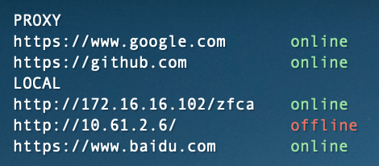

Proxy Check Übersicht Widget
==========================

Introduction
-------
1. This plugin is a software for the MAC that detects if the system proxy is normal and displays the results on the desktop.
2. This plugin is modified based on the [check-urls.widget](http://tracesof.net/uebersicht-widgets/#check-urls) plugin.
3. The use of this plugin requires the installation of [Ubersicht](http://tracesof.net/uebersicht/) software.

Detection principle
-------
A request is made to the url through the bash script, and if it returns `200`, it is considered to be connected.

Environmental requirements
-------
1. Install ubersicht software
2. Install proxy software(ssr,easyConnect...)

Installation method
-------
1. Open the Ubersicht Widget folder.
2. `git clone` this repository and move the code to the above folder.

How to use
-------
- Add the URLs that need to be detected in the `local network` environment to the `locallist.list` file.
- Add the URLs that need to be detected in the `Proxy Network` environment to the `proxylist.list` file.

For example
-------

中文版说明请点击[此处](./README_CN.md)。